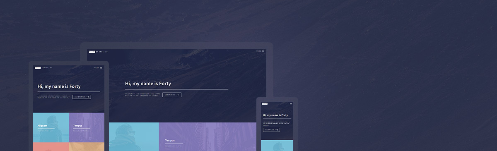

# Forty - Jekyll Theme

A Jekyll version of the "Forty" theme by [HTML5 UP](https://html5up.net/).  



# How to Use

For those unfamiliar with how Jekyll works, check out [jekyllrb.com](https://jekyllrb.com/) for all the details, 
or read up on just the basics of [front matter](https://jekyllrb.com/docs/frontmatter/), [writing posts](https://jekyllrb.com/docs/posts/), 
and [creating pages](https://jekyllrb.com/docs/pages/).

- **GitLab**: Simply fork this repository and start editing the `_config.yml` file!  
- **GitHub**: Fork this repository and create a branch named `gh-pages`, then start editing the `_config.yml` file.

# Added Features

* **[Formspree.io](https://formspree.io/) contact form integration** - just add your email to the `_config.yml` and it works!
* Use `_config.yml` to **set whether the homepage tiles should pull pages or posts**, as well as how many to display.
* Add your **social profiles** easily in `_config.yml`. Only social profiles buttons you enter in `config.yml` show up on the site footer!
* Set **featured images** in front matter.

# Issues

If you would like to report a bug, ask a question, request a feature, feel free to do so on [the GitLab repository](https://gitlab.com/andrewbanchich/forty-jekyll-theme) and I will be more than happy to help!

Alternatively, you can open an issue via email by emailing [incoming+andrewbanchich/forty-jekyll-theme@incoming.gitlab.com](mailto:incoming+andrewbanchich/forty-jekyll-theme@incoming.gitlab.com).

The GitHub repository is simply a mirror of the GitLab repository.

# Credits

Original README from HTML5 UP:

```
Forty by HTML5 UP
html5up.net | @ajlkn
Free for personal and commercial use under the CCA 3.0 license (html5up.net/license)


This is Forty, my latest and greatest addition to HTML5 UP and, per its incredibly
creative name, my 40th (woohoo)! It's built around a grid of "image tiles" that are
set up to smoothly transition to secondary landing pages (for which a separate page
template is provided), and includes a number of neat effects (check out the menu!),
extra features, and all the usual stuff you'd expect. Hope you dig it!

Demo images* courtesy of Unsplash, a radtastic collection of CC0 (public domain) images
you can use for pretty much whatever.

(* = not included)

AJ
aj@lkn.io | @ajlkn


Credits:

	Demo Images:
		Unsplash (unsplash.com)

	Icons:
		Font Awesome (fortawesome.github.com/Font-Awesome)

	Other:
		jQuery (jquery.com)
		html5shiv.js (@afarkas @jdalton @jon_neal @rem)
		background-size polyfill (github.com/louisremi)
		Misc. Sass functions (@HugoGiraudel)
		Respond.js (j.mp/respondjs)
		Skel (skel.io)
```

Repository [Jekyll logo](https://github.com/jekyll/brand) icon licensed under a [Creative Commons Attribution 4.0 International License](http://choosealicense.com/licenses/cc-by-4.0/).

# Local Preview

Build the image and serve the site on port 4123:

```bash
docker build -t subspacesignal-website .
docker run --rm -p 4123:4000 subspacesignal-website
```

Open http://localhost:4123. Rebuild the image after each change.

# Social Card

`_social-card/card.html` is the source of `assets/images/social/subspace-signal.png`, the 1200x630 image for link previews. Jekyll skips the folder. After a headline change, edit the HTML, render it with headless Chrome and bump the `?v=` number in `_includes/metatags.html`:

```bash
"/Applications/Google Chrome.app/Contents/MacOS/Google Chrome" --headless=new --hide-scrollbars \
  --virtual-time-budget=5000 --window-size=1200,630 \
  --screenshot=assets/images/social/subspace-signal.png "file://$PWD/_social-card/card.html"
```
